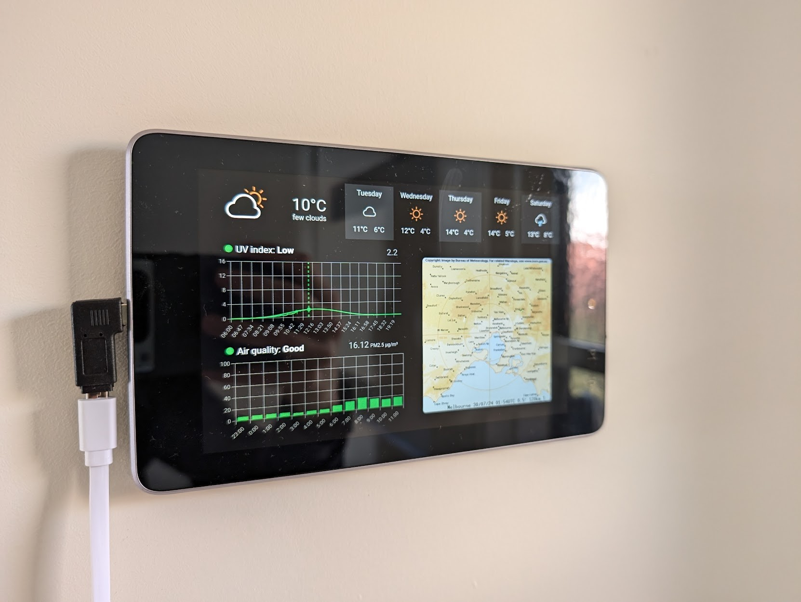
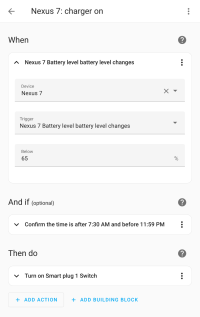
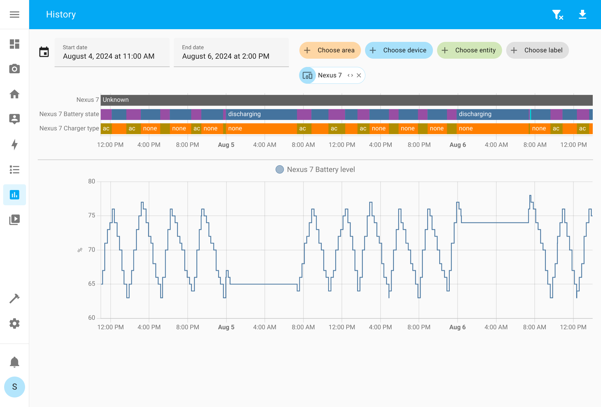
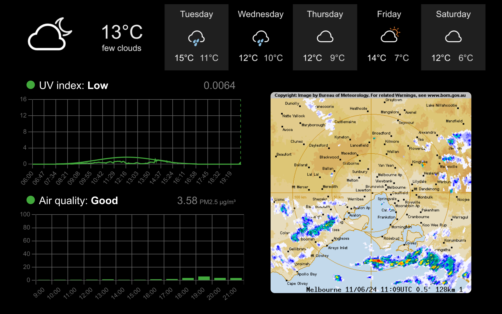

# Taikapeili[^1]



Here's how I made glanceable wall mounted weather display from an old Android
tablet. The display is motion activated and shows a weather forecast, the UV
radiation index for the day and an air quality estimate.

[^1]: _Taikapeili_ is Finnish for magic mirror.

## Hardware

- [Nexus 7 (2013)](https://wiki.lineageos.org/devices/flo/) Android tablet.
- [Xenon ZigBee smart plug](https://www.amazon.com.au/dp/B0CZ6VZ9NN?ref=ppx_yo2ov_dt_b_product_details&th=1)
  for controlling charging.

## Software

- A web app that displays the weather (i.e., this repository).
- [Chart.js](https://www.chartjs.org/) for rendering charts.
- [Fully Kiosk](https://www.fully-kiosk.com/) for running the web app on the tablet.
- Home Assistant automation for turning the charger on and off based on the charge level.

# OS setup

To save power and reduce the stress on the battery, I wanted to automatically
turn off the tablet overnight when it isn't needed and maintain a [65-75% state-of-charge](
https://batteryuniversity.com/article/bu-808-how-to-prolong-lithium-based-batteries)
on the battery.

## Automatic shutdown

I couldn't find any kind of scheduled shutdown functionality on the version of
Android on the tablet, so I opted to flash [LineageOS](https://wiki.lineageos.org/devices/flo/)
with root access so I could write a script to shut down automatically.

To power off the tablet at 00:30 every night, I created
`/data/local/userinit.sh` with the following contents:

```sh
#!/system/bin/sh
(while true; do test $(date +%H%M) -eq 0030 && /system/bin/reboot -p; sleep 30; done) &
exit 0
```

This script is automatically run by Android at boot.
(Don't forget to `chmod +x /data/local/userinit.sh`).

If the charger is connected when the device powers off like this, Android will
helpfully start up again to display charging status, defeating the whole purpose
of turning off the tablet. Luckily this can be disabled with:

```sh
fastboot oem off-mode-charge 0
```

## Charging control

If I had a more modern device, I could've used something like
[ACCA](https://f-droid.org/en/packages/mattecarra.accapp/) to set charge limits
right on tablet itself. However, the Nexus 7 doesn't support software charge
control, so this rube goldbergian contraption is the next best thing :)

The tablet is plugged into a Zigbee-enabled smart plug, which is connected to
[Home Assistant](https://www.home-assistant.io/). I also installed the
[Home Assistant Android app](https://play.google.com/store/apps/details?id=io.homeassistant.companion.android&hl=en_AU)
on the tablet so that it can monitor the battery level.

With this, I only needed a pair of automation rules to turn the charger on when
the battery drops below 65% and turn it off again when the level is above 75%:



I also added another rule to turn off the charger overnight and two others to
start and stop the charger for 10 minutes in the morning to trigger the tablet
to boot up again.

The graph below shows how this maintains the battery between 65-75% during the
day and keeps the tablet powered off during the night:



(Why does the tablet use so much power when on? tl;dr: It's the camera-based
motion detection to only turn the screen on when someone is looking at it.)

# Web app



The web app is a single HTML page that displays the following information:

- Weather forecast for the day (from https://weatherwidget.io/)
- UV index prediction for the day (from https://uvdata.arpansa.gov.au)
- Air quality measurement (from https://www.epa.vic.gov.au/, requires CORS
  bypass and an API key)
- Rain radar (from http://bom.gov.au, requires CORS bypass)

These data sources are mostly specific to Australia, so you'd need to find
equivalent services for your location.

Note that since some of the data is scraped directly from the source websites,
[Cross-Origin Resource Sharing (CORS)](https://developer.mozilla.org/en-US/docs/Web/HTTP/CORS)
must be disabled in the browser hosting the web app. I achieved this by using the
Fully Kiosk app.

## Kiosk setup

First, I copied the web app files to the tablet with adb:

```
adb shell mkdir -p /sdcard/taikapeili
adb push index.html old-js/*.js /sdcard/taikapeili/
```

Since the browser in this version of Android is so old, I had to use
[Babel](https://babeljs.io/) to rewrite some of the more modern JavaScript
features used by the app -- see `transpile.sh`.

After this I pointed Fully Kiosk at `file:///sdcard/taikapeili/index.html` with
the following settings:

 - Reload the web app every 10 minutes.
 - Use camera-based motion detection to light up the screen only when someone is
   looking at it. I dropped the motion detection framerate to 1 Hz to somewhat
   reduce the CPU load.
 - Starting Fully Kiosk automatically at boot.
